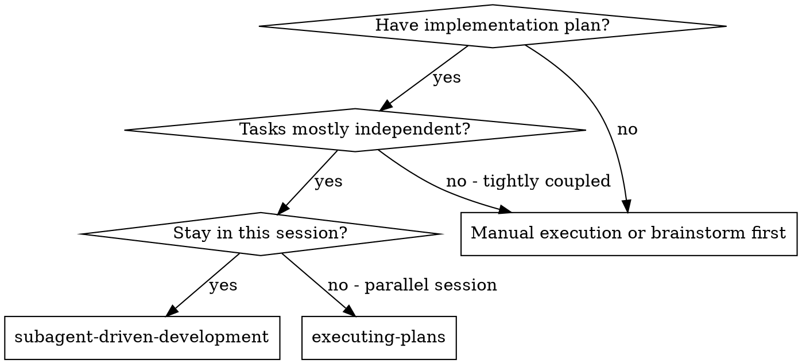
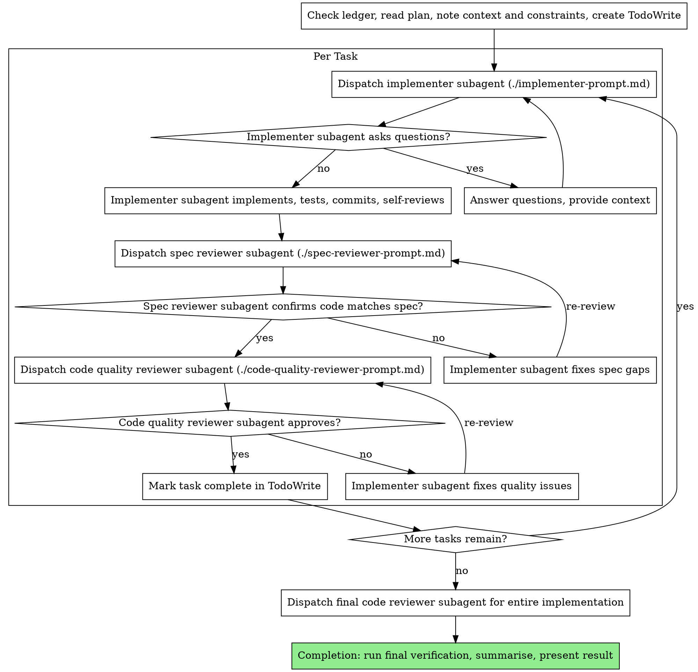

<!-- Adapted from superpowers (MIT license, Copyright Jesse Vincent 2025) -->

# Subagent-Driven Development

Execute plan by dispatching fresh subagent per task, with two-stage review after each: spec compliance review first, then code quality review.

**Why subagents:** You delegate tasks to specialized agents with isolated context. By precisely crafting their instructions and context, you ensure they stay focused and succeed at their task. They should never inherit your session's context or history — you construct exactly what they need. This also preserves your own context for coordination work.

**Core principle:** Fresh subagent per task + two-stage review (spec then quality) = high quality, fast iteration

## When to Use



**vs. Executing Plans (parallel session):**
- Same session (no context switch)
- Fresh subagent per task (no context pollution)
- Two-stage review after each task: spec compliance first, then code quality
- Faster iteration (no human-in-loop between tasks)

## The Process



**Before the first dispatch, check the ledger** (see Durable Progress). If one
exists from an earlier, compacted run, resume at the first task not recorded as
complete rather than starting over.

When dispatching an implementer subagent, include relevant knowledge from **knowledge-reader** results (already loaded during planning) in the implementer's prompt so they have domain context and standards.

For spec compliance review, dispatch the **plan-compliance-reviewer** agent instead of a generic reviewer.

For quality review, dispatch **knowledge-reader** with hint:
"Be thorough — include all standards, learnings, and review checklists that apply to these changes"
scoped to the changed files/areas. Include this in the quality reviewer's context.

After all tasks pass review, completion is handled inline:
1. Run final verification (full test suite)
2. Summarise what was implemented
3. Present the result to the developer
Does not invoke `finishing-a-development-branch`.

## Model Selection

Use the least powerful model that can handle each role to conserve cost and increase speed.

**Mechanical implementation tasks** (isolated functions, clear specs, 1-2 files): use a fast, cheap model. Most implementation tasks are mechanical when the plan is well-specified.

**Integration and judgment tasks** (multi-file coordination, pattern matching, debugging): use a standard model.

**Architecture, design, and review tasks**: use the most capable available model.

**Task complexity signals:**
- Touches 1-2 files with a complete spec → cheap model
- Touches multiple files with integration concerns → standard model
- Requires design judgment or broad codebase understanding → most capable model

**Always specify the model explicitly when dispatching.** An omitted model
inherits the controller's own session model — often the most capable and most
expensive one available. Every dispatch you leave unspecified silently defeats
this entire section, and the effect is invisible: nothing in the output tells you
a transcription task ran on a frontier model.

**Turn count beats token price.** Wall-clock and context cost scale with how many
turns a subagent takes, and the cheapest models routinely take 2-3× the turns on
multi-step work — costing more overall than a mid-tier model that gets it right
first time. Use mid-tier as the **floor** for reviewers and for implementers
working from prose descriptions. Drop to the cheapest tier only when the task's
plan text contains the complete code, making the work transcription plus testing,
or for single-file mechanical fixes.

### Reasoning Effort

Effort is a separate dial from model choice, and the two are set independently.
Leaving it unset means every dispatch inherits the session's effort — so
transcription work gets frontier-grade deliberation while the reviews that
actually catch defects get whatever the session happened to be set to.

Match effort to how much the step benefits from deliberation, not to how
important the step feels:

| Stage | Effort | Why |
|---|---|---|
| Implementer, complete plan code | low | Transcription and running tests. Extra deliberation buys nothing. |
| Implementer, prose description | medium | Real decisions about structure and naming. |
| Spec compliance review | medium | Comparison against a written list. |
| Code quality review | high | This is where defects are actually caught. |
| Adversarial verification, judge panels | high | The stage whose entire value is catching what looks fine. |
| Architecture, design, final whole-branch review | high or above | Broad context, subtle interactions. |

The asymmetry is deliberate: **spend deliberation on the checks, not on the
typing.** A cheap, low-effort implementer whose work is caught by a high-effort
reviewer is faster and better than the reverse.

## Durable Progress

Conversation memory does not survive compaction. A controller that loses its
place will re-dispatch entire completed task sequences — the single most
expensive failure mode this workflow has. Track progress in a file, not only in
TodoWrite.

- At skill start, check for a ledger (e.g. `.agent/sdd/progress.md`).
  Tasks recorded there as complete **are** complete — do not re-dispatch them;
  resume at the first task not marked complete.
- **Exclude the artefact directory from git before writing anything into it.**
  Implementers commit their own work; an untracked `.agent/sdd/` gets swept into
  their commits, and a `review-N.diff` written for one task then appears inside
  the diff the *next* reviewer reads. Append the directory to
  `.git/info/exclude` (local-only, leaves the project's tracked `.gitignore`
  alone) unless the repo already ignores it. If the project has its own
  convention for local agent artefacts, use that path instead.
- When a task's review comes back clean, append one line:
  `Task N: complete (commits <base7>..<head7>, review clean)`.
- Record Minor findings you deferred, and any decision the human made that
  changes later tasks. These are exactly what a compacted controller cannot
  reconstruct and cannot infer from the code.
- The ledger is a recovery map: the commits it names exist in git even when your
  context no longer remembers creating them. After compaction, trust the ledger
  and `git log` over your own recollection.

## File Handoffs

Everything pasted into a dispatch prompt — and everything a subagent prints back
— stays resident in your context for the rest of the session and is re-read on
every later turn. Move bulk artefacts as files:

- **Task brief:** extract the one task's full text to its own file and give the
  subagent that path. This is not the same as making a subagent read the whole
  plan (see Red Flags): the brief is exactly one task, and it keeps the exact
  values, signatures, and test cases out of your context while remaining the
  single source of requirements.
- **Report file:** name it after the brief and pass the path in the dispatch. The
  subagent writes its full report there and returns only status, commits, a
  one-line test summary, and concerns.
- **Reviewer inputs:** hand the reviewer file paths — the brief, the report, and
  the diff. Write the diff to a uniquely named file first
  (`git log --oneline BASE..HEAD`, `git diff --stat BASE..HEAD`, and
  `git diff -U10 BASE..HEAD` redirected to one file). The reviewer sees commits,
  stat summary, and full context in one read, and none of it enters your context.
- Use the BASE you recorded **before** dispatching the implementer — never
  `HEAD~1`, which silently truncates a multi-commit task to its last commit.
- A dispatch prompt describes one task, not the session's history. Do not paste
  accumulated prior-task summaries into later dispatches.

## Constructing Reviewer Prompts

A review finds what it is pointed at. A generic "review this diff" reliably
misses defects that look correct in isolation — which is most of the defects
worth catching.

- **Name the specific risk.** If a task builds something later tasks depend on,
  say so and describe the failure shapes concretely ("a fixture that is healthy
  for the wrong reason", "a test that asserts a value the test itself supplied").
  Observed directly: a targeted review found two Critical defects that a generic
  review of the same diff did not surface.
- **Copy the binding constraints verbatim** from the plan's global constraints —
  exact values, formats, and stated relationships. The template carries the
  process rules; this block is what *this* project demands.
- **Never pre-judge findings.** Do not instruct a reviewer to ignore something or
  cap its severity. If a prompt you are writing contains "do not flag", "don't
  treat X as a defect", or "at most Minor" — stop. You are spending the review to
  spare yourself a loop. Let it raise the finding and adjudicate it.

  Narrowing *scope* is legitimate and different: "review the change, not the
  pre-existing codebase" bounds what the reviewer looks at. "Don't flag X" tells
  it what conclusion it may not reach about something already in scope. Bound the
  diff; never bound the verdict.
- **Do not ask a reviewer to re-run the test suite** the implementer already ran
  on the same code; the implementer's report carries that evidence. This is about
  re-running commands, not about trust — reviewers still verify every claim by
  reading the code, and still run a test themselves when the *claim under review*
  is that a specific test fails for a specific reason.

### Adversarial Verification

For findings that are expensive to act on, or claims that sound plausible but
would be costly if wrong, verify before acting. Spawn independent checkers
prompted to **refute** the claim, and drop it if a majority do:

- Prompt each to argue the finding is *not* real, defaulting to refuted when
  uncertain. Redundant identical checkers add little — give each a distinct lens
  (correctness, security, does-it-actually-reproduce) when a claim can fail in
  more than one way.
- This is where high effort earns its cost. A verifier that agrees by default is
  worse than no verifier, because it converts a guess into an endorsement.

Apply this to the final whole-branch review's findings and to any Critical, not
to every Minor — the point is to stop plausible-but-wrong findings from driving
expensive changes, not to double the cost of every review.

## Handling Implementer Status

Implementer subagents report one of four statuses. Handle each appropriately:

**DONE:** Proceed to spec compliance review.

**DONE_WITH_CONCERNS:** The implementer completed the work but flagged doubts. Read the concerns before proceeding. If the concerns are about correctness or scope, address them before review. If they're observations (e.g., "this file is getting large"), note them and proceed to review.

**NEEDS_CONTEXT:** The implementer needs information that wasn't provided. Provide the missing context and re-dispatch.

**BLOCKED:** The implementer cannot complete the task. Assess the blocker:
1. If it's a context problem, provide more context and re-dispatch with the same model
2. If the task requires more reasoning, re-dispatch with a more capable model
3. If the task is too large, break it into smaller pieces
4. If the plan itself is wrong, escalate to the human

**Never** ignore an escalation or force the same model to retry without changes. If the implementer said it's stuck, something needs to change.

## Prompt Templates

- `./implementer-prompt.md` - Dispatch implementer subagent
- `./spec-reviewer-prompt.md` - Dispatch spec compliance reviewer subagent
- `./code-quality-reviewer-prompt.md` - Dispatch code quality reviewer subagent

## Example Workflow

```
You: I'm using Subagent-Driven Development to execute this plan.

[Check .agent/sdd/progress.md — no ledger, this is a fresh run]
[Confirm .agent/ is excluded from git; add it to .git/info/exclude]
[Read plan file once: docs/plans/feature-plan.md]
[Note global constraints and cross-task context; create TodoWrite with all tasks]

Task 1: Hook installation script

[Write Task 1's text to .agent/sdd/task-1-brief.md]
[Record BASE = current HEAD, before dispatching]
[Dispatch implementer (model: cheap, effort: low — plan carries complete code)
 with the brief path + report path + scene-setting context]

Implementer: "Before I begin - should the hook be installed at user or system level?"

You: "User level (~/.config/hooks/)"

Implementer: "Got it. Implementing now..."
[Later] Implementer:
  - Implemented install-hook command
  - Added tests, 5/5 passing
  - Self-review: Found I missed --force flag, added it
  - Committed

[Write BASE..HEAD diff to .agent/sdd/review-1.diff]
[Dispatch spec compliance reviewer (effort: medium) with brief + report + diff paths]
Spec reviewer: ✅ Spec compliant - all requirements met, nothing extra

[Dispatch code quality reviewer (effort: high), naming the specific risk:
 "Task 1 builds the fixture every later task asserts against — look for a
  fixture healthy for the wrong reason, and tests that cannot fail"]
Code reviewer: Strengths: Good test coverage, clean. Issues: None. Approved.

[Mark Task 1 complete in TodoWrite AND append to ledger:
 "Task 1: complete (commits a1b2c3d..e4f5g6h, review clean)"]

Task 2: Recovery modes

[Get Task 2 text and context (already extracted)]
[Dispatch implementation subagent with full task text + context]

Implementer: [No questions, proceeds]
Implementer:
  - Added verify/repair modes
  - 8/8 tests passing
  - Self-review: All good
  - Committed

[Dispatch spec compliance reviewer]
Spec reviewer: ❌ Issues:
  - Missing: Progress reporting (spec says "report every 100 items")
  - Extra: Added --json flag (not requested)

[Implementer fixes issues]
Implementer: Removed --json flag, added progress reporting

[Spec reviewer reviews again]
Spec reviewer: ✅ Spec compliant now

[Dispatch code quality reviewer]
Code reviewer: Strengths: Solid. Issues (Important): Magic number (100)

[Implementer fixes]
Implementer: Extracted PROGRESS_INTERVAL constant

[Code reviewer reviews again]
Code reviewer: ✅ Approved

[Mark Task 2 complete]

...

[After all tasks]
[Dispatch final code-reviewer]
Final reviewer: All requirements met, ready to merge

[Run final verification - full test suite]
[Summarise what was implemented]
[Present result to developer]

Done!
```

## Advantages

**vs. Manual execution:**
- Subagents follow TDD naturally
- Fresh context per task (no confusion)
- Parallel-safe (subagents don't interfere)
- Subagent can ask questions (before AND during work)

**vs. Executing Plans:**
- Same session (no handoff)
- Continuous progress (no waiting)
- Review checkpoints automatic

**Efficiency gains:**
- Controller curates exactly what context is needed
- Bulk artefacts (briefs, reports, diffs) move as files, so they never occupy
  controller context or get re-read on every subsequent turn
- Subagent gets complete information upfront
- Questions surfaced before work begins (not after)
- Progress survives compaction, so completed work is never redone

**Quality gates:**
- Self-review catches issues before handoff
- Two-stage review: spec compliance, then code quality
- Review loops ensure fixes actually work
- Spec compliance prevents over/under-building
- Code quality ensures implementation is well-built

**Cost:**
- More subagent invocations (implementer + 2 reviewers per task)
- Controller does more prep work (extracting all tasks upfront)
- Review loops add iterations
- But catches issues early (cheaper than debugging later)

## Red Flags

**Never:**
- Start implementation on main/master branch without explicit user consent
- Skip reviews (spec compliance OR code quality)
- Proceed with unfixed issues
- Dispatch multiple implementation subagents in parallel (conflicts)
- Make a subagent read the **whole plan file** — hand it a brief containing only
  its own task (see File Handoffs). Pasting that task's full text into the prompt
  also works but keeps it in your context for the rest of the session; a file does
  not.
- Skip scene-setting context (subagent needs to understand where task fits)
- Omit the model on a dispatch (it silently inherits your session's model)
- Re-dispatch a task the ledger already records as complete
- Ignore subagent questions (answer before letting them proceed)
- Accept "close enough" on spec compliance (spec reviewer found issues = not done)
- Skip review loops (reviewer found issues = implementer fixes = review again)
- Let implementer self-review replace actual review (both are needed)
- **Start code quality review before spec compliance is ✅** (wrong order)
- Move to next task while either review has open issues

**If subagent asks questions:**
- Answer clearly and completely
- Provide additional context if needed
- Don't rush them into implementation

**If reviewer finds issues:**
- Implementer (same subagent) fixes them
- Reviewer reviews again
- Repeat until approved
- Don't skip the re-review

**If subagent fails task:**
- Dispatch fix subagent with specific instructions
- Don't try to fix manually (context pollution)

## Integration

**Required workflow skills:**
- **writing-plans** - Creates the plan this skill executes

**Review workflow:**
- Code review is handled within this skill's built-in two-stage review loop using reviewer subagents and the instructions in this document; no separate `requesting-code-review` skill is required.

**Used agents:**
- **knowledge-reader** - Provides domain context and standards for implementer prompts and quality review
- **plan-compliance-reviewer** - Handles spec compliance review for each task

**Subagents should use:**
- **test-driven-development** - Subagents follow TDD for each task

**Alternative workflow:**
- **executing-plans** - Use for parallel session instead of same-session execution
